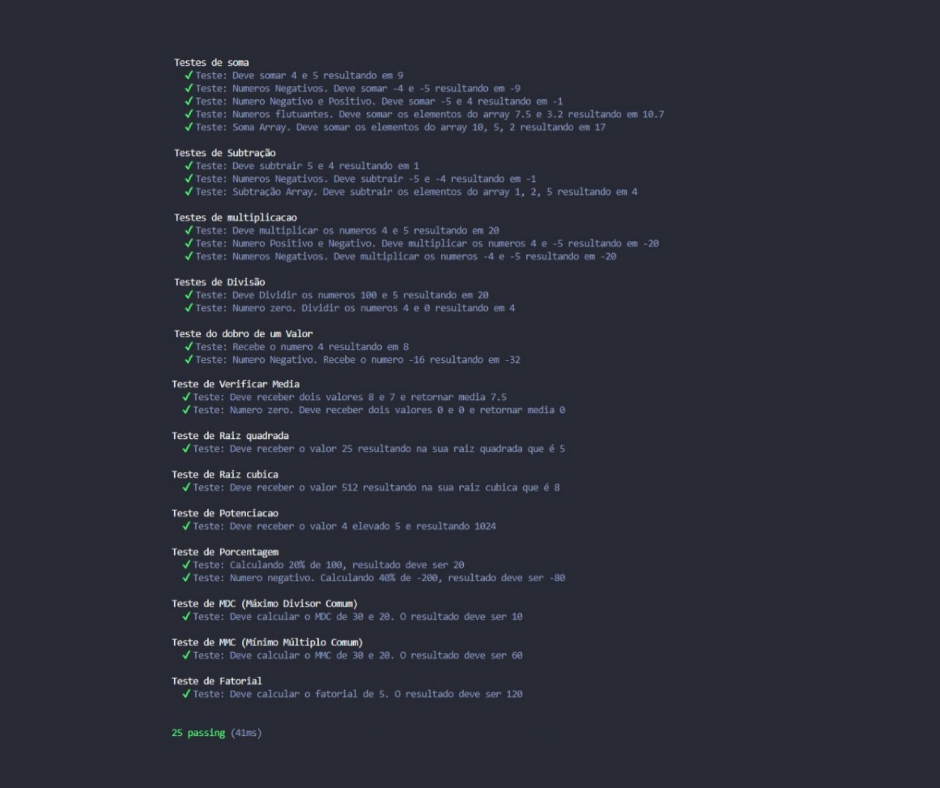

  

<iframe src="https://giphy.com/embed/erCdSSqH0vgHVUhkIx" width="480" height="156" frameBorder="0" class="giphy-embed" allowFullScreen></iframe>

.gif)  

---
<h3>

[   ](https://youtu.be/CRL06qn1gf4)</h3>
### 📢 ATENÇÃO!   Antes de iniciar clique acima 👆 e assista o vídeo de Introdução deste Repositório. 🎞 

  
  
  <h1>👋 Olá! Eu sou o Ewerton Alexander... </h1>

  
<h1 align="center">
  
  
  
  

  <h2>Este repositório é referente a Sprint 4 do Time Rocketman🚀</h2>
<h3>Programa de Bolsas da Compass.Uol</h3> 

[ ](https://compass.uol/pt/?utm_source=google-ads&utm_medium=ppc&utm_campaign=compasso-uol-institucional&utm_term=compasso.uol&gclid=CjwKCAjwtcCVBhA0EiwAT1fY73MnCX65NyHVN-U5XhHq5vqe2SxjcGsPuhhWX6fIqpjGZzgB7k3qRxoCmQsQAvD_BwE)

<strong>*Clique na logo acima 👆 para conhecer mais da Compass Uol.*</strong> 

  
 

 

  <h1>Atividades Sprint 4:</h2>

<h2>Todas os projetos serão desenvolvidos com:</h2>

[]
[]
[]
[]
[]
[]
  

 

  

 
 ## 🚀 Serão estudados os seguintes tópicos:
 

 
 ### Aqui estarão listados todos os assuntos que iremos estudar no decorrer dessa Sprint.
 
 
> 1️⃣ Sistema GIT para versionamento de arquivos.  |   Status: Concluído ✅   
> 2️⃣ Plataforma e ferramentas GitHub.  |   Status: Concluído ✅   
> 3️⃣ Linguagem de programação Javascript.  |   Status: Concluído ✅   
> 4️⃣ KOANS JS - Aprendizado sobre refatoração de testes automatizados.  |   Status: Concluído ✅   
> 5️⃣ TDD - Test Driven Development ou Desenvolvimento Guiado por Testes  |   Status: Concluído ✅   
> 6️⃣ Bibliotecas como Mocha e Chai.  |   Status: Concluído ✅   

  

  <h2>🚀 Pré-requisitos:</h2>
 

 
### Aqui são listados os pré requisitos do projeto, assim como os comandos, links para a instalação dos mesmos e do passo a passo para Utilizar o Git e Github.  

> 1️⃣ <strong>Instalar o Visual Studio Code.</strong> Clique para Instalar 👇  
[ ](https://code.visualstudio.com/download) 
> 2️⃣ <strong>Instalar o Git.</strong> Clique para Instalar 👇  
[ ](https://git-scm.com/downloads) 
> 3️⃣ <strong>Crie uma conta no GitHub</strong> Clique para Acessar 👇  
[ ](https://github.com/) 
> 4️⃣ <strong>Siga o passo a passo para usar o Git e Github</strong> Clique para Acessar 👇  
[ ](https://github.com/Ewertonalex/Rocketman_Ewerton_Alexander_Compass/tree/develop/Tutorial%20Git%20e%20Github) 

  

## 🚀 Como será Avaliado o Challenge:

### Para recerbemos o feedebak final de nosso Projeto, este Challenge deve seguir os critérios abaixo listados, para serem avaliados.

1️⃣ Nome do repositório, branches e commits diários;  
2️⃣ Organização das pastas, arquivos e código;  
3️⃣ O README.md contendo as informações do projeto;  
4️⃣ Instalação e funcionamento dos códigos;  
5️⃣ Métodos robustos na classe calculadora.js;  
6️⃣ Arquivo(s) de teste com testes eficientes;  
7️⃣ Nome das variáveis e métodos;  
8️⃣ Plágio!.

  
  
  
## 🚀 Andamento do Projeto (Pastas):

1️⃣ <strong>Utilizando o Git e Github, tutorial de como usei;</strong> Clique para Acessar 👇  
[ ](https://github.com/Ewertonalex/Rocketman_Ewerton_Alexander_Compass/tree/develop/Tutorial%20Git%20e%20Github) 
2️⃣ <strong>Curso JavaScript, aulas e projetos;</strong> Clique para Acessar 👇  
[ ](https://github.com/Ewertonalex/Rocketman_Ewerton_Alexander_Compass/tree/develop/Javascript) 
3️⃣ <strong>Utilizando as Bibliotecas Mocha e Chai;</strong> Clique para Acessar 👇  
[ ](https://github.com/Ewertonalex/Rocketman_Ewerton_Alexander_Compass/tree/develop/mocha-chai) 
4️⃣ <strong>Construindo Calculadora em JS, usando Mocha e Chai;</strong> Clique para Acessar 👇  [ ](https://github.com/Ewertonalex/Rocketman_Ewerton_Alexander_Compass/tree/develop/mocha-chai) 

  
  
  
## 🚀 Calculadora com Mocha e Chai em Javascript:
<strong>Aqui construí uma calculadora com algumas operações matemáticas abaixo listadas, usando o que foi aprendido nas aulas da Sprint 4 de TDD com Mocha e Chai.</strong>

 
<strong>Testes Usados na Calculadora</strong>  

1️⃣ Soma (Numeros inteiros, negativos e flutuantes) 
2️⃣ Soma de um Array 
3️⃣ Subtração 
4️⃣ Subtração de um Array 
5️⃣ Multiplicação 
6️⃣ Divisão 
7️⃣ Dobro de um valor 
8️⃣ Média 
9️⃣ Raiz Quadrada 
🔟 Raiz Cúbica 
1️⃣1️⃣ Potenciação 
1️⃣2️⃣ Porcentagem 
1️⃣3️⃣ Máximo Divisor Comum 
1️⃣4️⃣ Mínimo Múltiplo Comum 
1️⃣5️⃣ Fatorial 
1️⃣6️⃣ Converter Decimal para Binário 

<h3> Resultado dos Testes ✔️ </h3>

 

  

## 🚀 Créditos:

  
### Aqui estão os sites utilizados como referência:

- https://github.com/rafaballerini
- https://www.youtube.com/c/rafaellaballerini
- https://mochajs.org/
- https://www.chaijs.com/
- https://www.delftstack.com/
- https://pt.stackoverflow.com/
 

  
### 💜 Um super thanks 👏 para essa galera que me apoiou nesse projeto:

<table>
  <tr>
    <td align="center"><a href="https://www.linkedin.com/in/analuizanasc/"> <b>Ana Luiza</b></a> 👨‍🚀</a></td>
  
  <td align="center"><a href="https://www.linkedin.com/in/giordano-palmezano-90585b222/"> <b>Giornado Palmezano</b></a> 👨‍🚀</a></td>

  <td align="center"><a href="https://www.linkedin.com/in/anasofiaoliveira1/"> <b>Ana Sofia</b></a> 👨‍🚀</a></td>
        
  </tr>
</table>

  
 
  
 <h3> Feito por:   
  

 
<a href="https://www.linkedin.com/in/ewerton-alexander-780869232/" target="_blank">Ewerton Alexander</a>!<g-emoji class="g-emoji" alias="wave" fallback-src="https://github.githubassets.com/images/icons/emoji/unicode/1f44b.png">👋</g-emoji></h3>

   
 
### Obrigado! Que a Força esteja com você!
  
 
  

